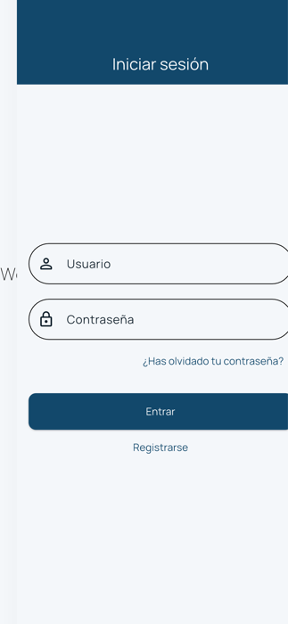
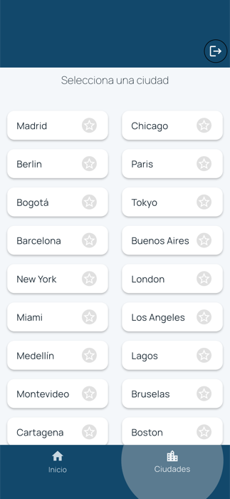
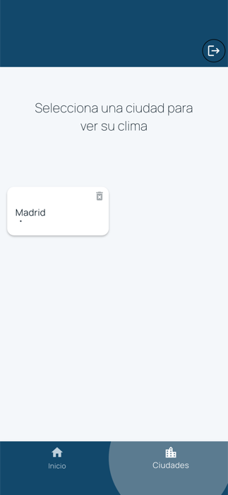
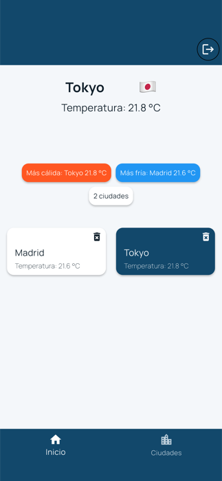
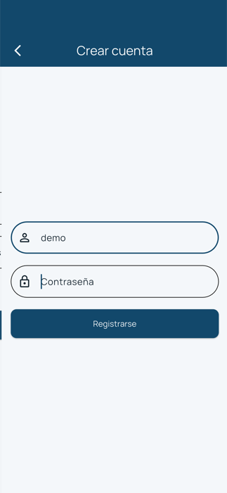

# Weather Bnka

Aplicación móvil que muestra la temperatura actual de las ciudades que el usuario elige seguir,
con registro y sesión en el dispositivo. Funciona en **iOS y Android desde el mismo código**.

<p align="center">
  
  
  
  
</p>

<p align="center">
  <sub>Inicio de sesión · catálogo de ciudades · una ciudad consultándose ·
  panel con la ciudad seleccionada destacada</sub>
</p>

> Capturas tomadas en un iPhone 15, **generadas por la propia suite de pruebas**
> (`integration_test/screenshots_test.dart`): se regeneran solas y por eso no pueden quedar
> desactualizadas respecto a la aplicación.

---

## Para qué se construyó

Es una pieza de demostración. La app es deliberadamente pequeña —consultar un clima no tiene
misterio— porque lo que se quiso mostrar no es la funcionalidad, sino **cómo se construye algo que
después se pueda mantener, cambiar y hacer crecer sin romperlo**.

Un producto real rara vez falla por lo que hace el día que se entrega. Falla seis meses después,
cuando hay que cambiar el proveedor de datos, sumar un idioma, entrar a un mercado nuevo o meter a
otra persona en el equipo. Ese es el escenario que este proyecto está preparado para resistir, y
cada decisión de abajo existe por esa razón.

## Qué resuelve, en la práctica

| Decisión | Qué significa para el producto |
|---|---|
| **El corazón del negocio está aislado del proveedor de datos** | Hoy consume una API meteorológica pública y gratuita. Cambiarla por otra —o por un servicio propio, o por datos de pago— **no obliga a tocar las pantallas**: se sustituye una pieza y el resto sigue igual. Es la diferencia entre migrar en días y reescribir. |
| **La lógica vive en un módulo independiente** | El dominio del clima es un paquete cerrado y reutilizable. Si mañana hay una segunda app —un panel web, una versión para tablet, un widget— **parte de este trabajo se reutiliza tal cual**. |
| **60 pruebas automatizadas** | Cada cambio futuro se valida solo. Reduce el coste de cada iteración y el riesgo de que una mejora rompa algo que ya funcionaba: el clásico "arreglamos A y se cayó B". |
| **Un recorrido probado sobre un móvil real** | Además de las pruebas de laboratorio, hay una que **maneja la app de verdad** en un dispositivo: se registra, elige una ciudad y comprueba lo que ve el usuario. Lo que se afirma aquí está medido, no supuesto. |
| **Preparada para más de un idioma** | Ningún texto está escrito dentro del código. Hoy está en español; **sumar otro idioma es traducir un archivo**, sin tocar la aplicación. |
| **Accesibilidad verificada, no declarada** | El contraste de cada color cumple el estándar internacional WCAG AA, y hay una prueba automática que lo mide. Legible para quien tiene baja visión, y a la altura de los requisitos de accesibilidad que ya exigen varios mercados. |
| **Estados de carga explícitos** | Cuando una ciudad está consultándose, su tarjeta lo indica y la pantalla **no muestra información a medias ni datos de otra ciudad**. Si la consulta falla, se conserva lo último válido en lugar de dejar la pantalla en blanco. La app nunca miente sobre lo que sabe. |

## Criterio, no solo ejecución

Durante el desarrollo se construyó una función que teñía la app entera según el clima. Al probarla
con datos reales se comprobó que **no aportaba nada**: la fuente informa el estado del cielo, no la
temperatura, y casi todas las ciudades caen en la misma categoría, así que la app se veía igual
mostrando 11 °C que 22 °C. **Se retiró.**

Queda documentada en el historial del proyecto, con la medición que llevó a descartarla. Saber qué
no incluir —y poder justificarlo con datos— suele valer más que la función misma.

---

## Resumen del estado

| | |
|---|---|
| Plataformas | iOS y Android, compilación de producción verificada en ambas |
| Pruebas | 62 automatizadas, todas en verde |
| Análisis estático | sin observaciones |
| Accesibilidad | WCAG AA verificado por prueba |
| Idiomas | español, con la base lista para añadir más |

> **Para probarla: primero hay que crear una cuenta.** No existe un usuario de demostración, porque
> el registro es local al dispositivo. En la pantalla inicial pulsa **Registrarse** e inventa un
> usuario y una contraseña de **4 caracteres como mínimo** (por ejemplo `demo` / `1234`). El registro
> deja la sesión iniciada y entra directo a la aplicación. No se envía nada a ningún servidor.

> **Alcance:** es una demostración técnica, no un producto listo para publicar en las tiendas. El
> registro es local al dispositivo y falta la firma digital de distribución. Ambas cosas están
> detalladas, sin adornos, en [Alcance y decisiones de diseño](#alcance-y-decisiones-de-diseño).

---

## Para el lector técnico

Lo que sigue documenta la implementación: **Clean Architecture** con organización por features,
**BLoC** como gestor de estado, un **paquete de dominio desacoplado** publicado localmente, e
inyección de dependencias mediante *service locator*.

---

## Tabla de contenidos

- [Funcionalidades](#funcionalidades)
- [Arquitectura](#arquitectura)
- [Estructura del proyecto](#estructura-del-proyecto)
- [Flujo de datos](#flujo-de-datos)
- [Gestión de estado (BLoC)](#gestión-de-estado-bloc)
- [Tema y accesibilidad](#tema-y-accesibilidad)
- [Internacionalización](#internacionalización)
- [Inyección de dependencias](#inyección-de-dependencias)
- [API externa](#api-externa)
- [Persistencia local](#persistencia-local)
- [Dependencias](#dependencias)
- [Puesta en marcha](#puesta-en-marcha)
- [Compilación por plataforma](#compilación-por-plataforma)
- [Calidad de código y pruebas](#calidad-de-código-y-pruebas)
- [Alcance y decisiones de diseño](#alcance-y-decisiones-de-diseño)
- [Roadmap](#roadmap)

---

## Funcionalidades

| # | Funcionalidad | Detalle |
|---|---|---|
| 1 | **Registro local** | Alta de usuario con validación de formulario; se persiste en el dispositivo. |
| 2 | **Login** | Valida credenciales contra el usuario registrado; si no existe, invita a registrarse. |
| 3 | **Catálogo de ciudades** | 20 ciudades seleccionables desde una grilla con marcado de favoritos. |
| 4 | **Consulta de clima** | Al marcar una ciudad se resuelve su geolocalización y se consulta su temperatura actual. |
| 5 | **Panel principal** | Tarjetas por ciudad seguida, con detalle de la ciudad seleccionada y bandera del país. |
| 6 | **Agregados en vivo** | Ciudad más cálida, ciudad más fría y conteo total, recalculados en cada cambio. |
| 7 | **Eliminar ciudad** | Quita una ciudad del panel y sincroniza el estado del catálogo. |
| 8 | **Logout** | Limpia la sesión persistida y devuelve al login sin dejar rutas en el stack. |
| 9 | **Carga visible** | Cada ciudad muestra un spinner en su tarjeta mientras se resuelve; el panel conserva la ciudad anterior hasta que la nueva termina. |

Navegación: `Splash` (3,5 s con animación) → `Login` ⇄ `Signup` → `Home` (tabs *Home* / *Cities*).

---

## Arquitectura

El proyecto aplica **Clean Architecture** con organización **feature-first**, y lleva la separación
un paso más allá: el dominio del clima vive en un **paquete Dart independiente**
(`packages/weather_repository`), consumido por la app como una dependencia local.

```
┌──────────────────────────────────────────────────────────────┐
│  PRESENTATION                                                │
│  Pages · Widgets · BLoC (Events → States)                    │
│  Depende de: Domain                                          │
└───────────────────────────┬──────────────────────────────────┘
                            │  (usa abstracciones)
┌───────────────────────────▼──────────────────────────────────┐
│  DOMAIN                                                      │
│  Entities · Repository (abstract) · Use Cases                │
│  Depende de: nada. Puro Dart.                                │
└───────────────────────────▲──────────────────────────────────┘
                            │  (implementa abstracciones)
┌───────────────────────────┴──────────────────────────────────┐
│  DATA                                                        │
│  Models (DTO) · Repository Impl · Data Sources (Dio / Prefs) │
│  Depende de: Domain                                          │
└──────────────────────────────────────────────────────────────┘
```

**Regla de dependencia.** Las flechas apuntan siempre hacia el dominio. `WeatherBloc` no conoce a
`Dio` ni a Open-Meteo: solo conoce `GetWeatherUseCase`, que a su vez depende de la *abstracción*
`WeatherRepository`. La implementación concreta se inyecta en tiempo de arranque. Sustituir la fuente
de datos (otra API, una caché local, un mock de pruebas) no exige tocar ni una línea de la capa de
presentación.

**Por qué un paquete aparte.** `weather_repository` es un módulo cerrado con su propio `pubspec.yaml`,
su propio ciclo de vida y una **API pública explícita** definida en `lib/weather_repository.dart`.
Todo lo que vive bajo `lib/src/` es privado para los consumidores. Esto aporta:

- una frontera real, verificada por el compilador, en lugar de una convención de carpetas;
- reutilización directa desde otra app del mismo ecosistema;
- tiempos de análisis y prueba acotados al módulo.

**Modelos vs. entidades.** `LocationModel extends Location` y `WeatherModel extends Weather`: el DTO
hereda de la entidad de dominio y aporta `fromJson` / `toJson`. El contrato JSON queda confinado a la
capa de datos y el dominio nunca ve la forma de la respuesta HTTP.

---

## Estructura del proyecto

```
weather_bnka/
├── lib/
│   ├── main.dart                        # Bootstrap: DI + blocs raíz + MaterialApp
│   ├── injection_container.dart         # Registro de dependencias (GetIt)
│   ├── l10n/
│   │   └── app_es.arb                   # Toda la copia de la interfaz (español)
│   ├── config/
│   │   ├── routes/app_routes.dart       # Rutas nombradas vía onGenerateRoute
│   │   └── theme/app_theme.dart         # Tema único, con contraste verificado
│   ├── core/
│   │   └── util/utils.dart              # Extension String.toFlag (ISO-3166 → emoji)
│   └── features/
│       ├── auth/
│       │   ├── data/
│       │   │   ├── data_sources/shared_pref_helper.dart
│       │   │   └── repository/user_repository_impl.dart
│       │   ├── domain/
│       │   │   ├── entities/user.dart
│       │   │   ├── repository/user_repository.dart
│       │   │   └── usecases/login_usecase.dart
│       │   └── presentation/
│       │       ├── bloc/auth_bloc/      # auth_bloc · auth_event · auth_state
│       │       ├── pages/               # splash_screen · login_page · signup_page
│       │       └── widgets/
│       │           ├── auth_field.dart          # Campos compartidos por ambos formularios
│       │           ├── auth_failure_text.dart   # Traduce AuthFailureReason a copia
│       │           ├── login_form.dart
│       │           ├── signup_form.dart
│       │           └── action_button.dart
│       └── home/
│           └── presentation/
│               ├── bloc/                # weather_bloc · weather_event · weather_state
│               ├── pages/home_page.dart
│               └── widgets/             # weather_details · weather_cards · cities_list_cards
│
├── test/                                # Pruebas unitarias y de widget de la app
│   ├── helpers/pump_app.dart            # Andamiaje de localización para los tests
│   ├── config/app_theme_test.dart
│   └── features/{auth,home}/
│
├── integration_test/                    # Recorrido sobre un dispositivo real
│   └── weather_flow_test.dart
│
└── packages/
    └── weather_repository/              # Paquete de dominio independiente
        ├── lib/
        │   ├── weather_repository.dart  # Barrel: API pública del paquete
        │   └── src/
        │       ├── domain/
        │       │   ├── entities/        # Weather · Location · City · WeatherCity
        │       │   ├── repositories/    # WeatherRepository · CityRepository (abstract)
        │       │   └── usecases/        # GetWeather · GetLocation · GetCities
        │       └── data/
        │           ├── models/          # WeatherModel · LocationModel
        │           ├── data_sources/    # WeatherRemoteDataSource (Dio)
        │           └── repositories/    # WeatherRepositoryImpl · CityRepositoryImpl
        ├── test/                        # Suite propia del paquete
        └── pubspec.yaml
```

La feature `home` solo tiene capa de presentación **a propósito**: su dominio y sus datos viven en
`weather_repository`. La feature `auth` sí conserva las tres capas porque su persistencia es
específica de la aplicación.

---

## Flujo de datos

Ejemplo completo: el usuario marca **Madrid** como favorita.

```
Usuario toca la tarjeta
        │
        ▼
CitiesListCards ──add(MarkCityAsFavorite("Madrid"))──► WeatherBloc
        │                                                   │
        │                                    emit(CitiesLoading)
        │                                                   │
        │                              add(GetWeatherForCity("Madrid"))
        │                                                   │
        │                                    emit(WeatherCityLoading)
        │                                                   ▼
        │                                         GetLocationUseCase
        │                                                   ▼
        │                                  WeatherRepository (abstract)
        │                                                   ▼
        │                                     WeatherRepositoryImpl
        │                                                   ▼
        │                                    WeatherRemoteDataSource
        │                                                   ▼
        │                          GET geocoding-api.open-meteo.com/v1/search
        │                                                   ▼
        │                                  LocationModel.fromJson → Location
        │                                                   ▼
        │                          GetWeatherUseCase(lat, lon) → GET /v1/forecast
        │                                                   ▼
        │                                   WeatherModel.fromJson → Weather
        │                                                   │
        ▼                                    emit(WeatherCityLoaded)
Navega al tab Home ◄──────────────────────────────────────┘
        │
        ▼
WeatherDetails pinta la ciudad, su temperatura y su bandera
```

La resolución de una ciudad requiere **dos llamadas encadenadas**: primero geocodificación
(nombre → lat/lon) y luego pronóstico (lat/lon → temperatura). La orquestación de esa secuencia
vive en el BLoC, no en el widget ni en el repositorio.

---

## Gestión de estado (BLoC)

Se usa el patrón **BLoC** (`flutter_bloc`) con eventos y estados **inmutables** y comparados por
valor mediante `equatable`. Tanto eventos como estados se declaran `sealed`, lo que permite al
compilador verificar la exhaustividad del manejo.

### AuthBloc

Alcance **global**: se provee en la raíz del árbol (`main.dart`), porque el logout debe poder
dispararse desde cualquier pantalla autenticada.

| Eventos | Estados |
|---|---|
| `LoginEvent(username, password)` | `AuthInitial` |
| `SignupEvent(username, password)` | `AuthLoading` |
| `LogoutEvent()` | `AuthSuccess(user)` · `AuthFailure(error)` · `AuthLogout` |

### WeatherBloc

Alcance **global**: se provee en la raíz junto a `AuthBloc`. Vivir por encima del navegador es lo que
hace que **las ciudades seguidas sobrevivan al cambio de pestaña**, en vez de recargarse cada vez que
el usuario vuelve al panel.

| Eventos | Estados |
|---|---|
| `LoadCities()` | `WeatherInitial` · `WeatherLoading` |
| `MarkCityAsFavorite(cityName)` | `CitiesLoading` · `CitiesLoaded(cities)` · `CitiesFavoriteUpdated(cities)` |
| `GetWeatherForCity(city)` | `WeatherCityLoading(city)` · `WeatherCityLoaded(location, weather)` |
| `GetWeatherFavCities()` | `WeatherFavCitiesLoaded(list)` |
| `RemoveWeatherFavCity(city)` | `WeatherError(message)` |

**Encadenamiento de eventos.** `MarkCityAsFavorite` dispara internamente `GetWeatherForCity`: el
marcado de favorito y la carga de su clima son dos unidades de trabajo distintas, con sus propios
estados de carga y error, y así cada tarjeta puede mostrar su propio spinner sin bloquear la grilla.

`BlocListener` se usa para efectos de lado (navegación, `SnackBar`, diálogos) y `BlocProvider` para
la inyección del BLoC en el subárbol.

---

## Tema y accesibilidad

La app usa **un solo tema**, definido en `config/theme/app_theme.dart`.

Una versión anterior derivaba la paleta del pronóstico, y se descartó tras
verlo funcionando: el código WMO describe **el estado del cielo, no la
temperatura**, y en la práctica casi todas las ciudades reportan 0–3 (de
despejado a cubierto). El resultado era una app ámbar casi siempre, incluso
mostrando 11 °C, con las paletas de lluvia y tormenta sin aparecer nunca. Un
cromado que cambia bajo el usuario sin decirle nada es peor que uno que se
queda quieto.

**Todos los pares de color superan WCAG AA (4.5:1).** No es una afirmación de
buena fe: `app_theme_test` mide las razones de contraste de cada superficie
—etiquetas de botón, texto sobre la página, texto sobre tarjeta, estados de
error y el ítem activo de la barra inferior— y verifica primero su propia
aritmética comprobando que negro sobre blanco dé exactamente 21.

Esto surgió de un fallo real: la versión por clima pintaba "¿Has olvidado tu
contraseña?" en dorado sobre crema, **1.32:1**. El test existe para que no
vuelva a pasar inadvertido.

---

## Internacionalización

Toda la copia de la interfaz sale de `lib/l10n/app_es.arb` vía
`flutter_localizations`, y la app está fijada a **español**. Los plurales usan
ICU (`{count, plural, =1{1 ciudad} other{{count} ciudades}}`), así que la
concordancia es una entrada del ARB y no un ternario en el sitio de uso.

**Los mensajes no viven en el dominio.** `AuthFailure` transporta un
`AuthFailureReason` y `WeatherError` no lleva texto: un BLoC reporta *qué*
pasó, y decidir *cómo* decirlo es responsabilidad de la capa de presentación.
Eso permite además que un mismo fallo se exprese distinto por idioma sin tocar
lógica.

---

## Inyección de dependencias

`get_it` como *service locator*, con todo el grafo declarado en un único punto
(`lib/injection_container.dart`) e inicializado antes de `runApp`:

```dart
void main() async {
  WidgetsFlutterBinding.ensureInitialized();
  await initializeDependencies();
  runApp(const MyApp());
}
```

Criterio de registro:

| Tipo | Registro | Motivo |
|---|---|---|
| `Dio`, `SharedPreferences`, data sources, repositorios, casos de uso | `registerLazySingleton` | Sin estado propio; una instancia basta y se crea bajo demanda. |
| `AuthBloc`, `WeatherBloc` | `registerFactory` | Cada `BlocProvider` recibe una instancia nueva, con su propio ciclo de vida y su `close()`. |

Los repositorios se registran **contra su abstracción** (`getIt.registerLazySingleton<WeatherRepository>`),
no contra la implementación: es el punto exacto donde se cumple la inversión de dependencias.

---

## API externa

[**Open-Meteo**](https://open-meteo.com/) — API pública de meteorología, **sin API key** ni registro,
gratuita para uso no comercial.

| Propósito | Endpoint |
|---|---|
| Geocodificación (nombre → lat/lon + código de país) | `GET https://geocoding-api.open-meteo.com/v1/search?name={city}&count=1` |
| Clima actual | `GET https://api.open-meteo.com/v1/forecast?latitude={lat}&longitude={lon}&current_weather=true` |

El cliente HTTP es **Dio**, aislado en `WeatherRemoteDataSource`. Los errores de red se capturan en
esa frontera y se propagan como excepciones de dominio, que el BLoC traduce a `WeatherError`.

El código de país que devuelve la geocodificación se convierte a bandera con una `extension` sobre
`String` que desplaza cada letra ASCII al rango de *Regional Indicator Symbols* Unicode:

```dart
extension ConvertFlag on String {
  String get toFlag => toUpperCase().replaceAllMapped(
        RegExp(r'[A-Z]'),
        (m) => String.fromCharCode(m.group(0)!.codeUnitAt(0) + 127397),
      );
}
```

---

## Persistencia local

**`shared_preferences`**, encapsulado en `SharedPrefHelper` (capa de datos de `auth`). La entidad de
usuario se serializa a JSON bajo una única clave:

| Operación | Método |
|---|---|
| Registrar / guardar sesión | `setUser(UserEntity)` |
| Leer sesión | `getUser() → UserEntity?` |
| Cerrar sesión | `clearUser()` |

Ningún widget ni BLoC habla con `SharedPreferences` directamente: la dependencia entra por
`UserRepositoryImpl` y sale hacia la presentación como `LoginUseCase`.

---

## Dependencias

| Paquete | Versión | Rol en el proyecto |
|---|---|---|
| [`flutter_bloc`](https://pub.dev/packages/flutter_bloc) | 8.1.6 | Gestión de estado por eventos/estados y widgets de integración (`BlocProvider`, `BlocListener`). |
| [`bloc`](https://pub.dev/packages/bloc) | 8.1.4 | Núcleo del patrón, sobre el que se apoya `flutter_bloc`. |
| [`equatable`](https://pub.dev/packages/equatable) | 2.0.5 | Igualdad por valor en entidades, eventos y estados; evita reconstrucciones innecesarias. |
| [`get_it`](https://pub.dev/packages/get_it) | 7.7.0 | Service locator para la inyección de dependencias. |
| [`dio`](https://pub.dev/packages/dio) | 5.6.0 | Cliente HTTP (interceptores, timeouts y manejo de errores tipado). |
| [`shared_preferences`](https://pub.dev/packages/shared_preferences) | 2.3.2 | Almacenamiento clave-valor de la sesión. |
| [`flutter_localizations`](https://docs.flutter.dev/ui/accessibility-and-internationalization/internationalization) | SDK | Localización de la interfaz y de los widgets de Material. |
| [`intl`](https://pub.dev/packages/intl) | SDK | Mensajes ICU (plurales, interpolación) generados desde el ARB. |
| [`cupertino_icons`](https://pub.dev/packages/cupertino_icons) | 1.0.8 | Set de iconos iOS. |
| [`flutter_lints`](https://pub.dev/packages/flutter_lints) | 4.0.0 | Reglas de análisis estático recomendadas *(dev)*. |
| [`bloc_test`](https://pub.dev/packages/bloc_test) | 9.1.7 | Aserciones sobre secuencias de estados emitidas por un BLoC *(dev)*. |
| [`mocktail`](https://pub.dev/packages/mocktail) | 1.0.5 | Dobles de prueba sin generación de código *(dev)*. |
| [`integration_test`](https://docs.flutter.dev/testing/integration-tests) | SDK | Maneja la app real sobre un dispositivo o simulador *(dev)*. |

**Tipografía:** familia [Manrope](https://fonts.google.com/specimen/Manrope) (Light 300 / Regular 400 /
Bold 700) embebida en `assets/fonts/`.

---

## Puesta en marcha

### Requisitos

| Herramienta | Versión |
|---|---|
| Flutter SDK | 3.24.1 o superior (verificado con 3.35.4) |
| Dart SDK | ^3.5.1 (verificado con 3.9.2) |
| Xcode | 15+ · CocoaPods 1.16+ (solo iOS/macOS) |
| Android SDK | API 34 · **JDK 17** (Temurin 17 recomendado) |

### Instalación

```bash
git clone <url-del-repositorio>
cd weather_bnka

# Resuelve las dependencias de la app y del paquete local
flutter pub get

# iOS: instala los pods
cd ios && pod install && cd ..

flutter run
```

No hace falta ninguna variable de entorno ni API key: Open-Meteo es de acceso abierto.

### Primer uso

**No hay cuenta de demostración: hay que registrarse.** El usuario se guarda en el dispositivo, así
que cada instalación empieza en blanco.

1. Tras el splash, la app abre en **Iniciar sesión**.
2. Como todavía no hay nadie registrado, pulsa **Registrarse** y crea una cuenta:
   - **Usuario:** sin caracteres especiales (`demo` sirve).
   - **Contraseña:** **mínimo 4 caracteres** (`1234` sirve).

   

3. El registro deja la sesión iniciada y entra directo a la pantalla principal.
4. En la pestaña **Ciudades**, toca una para seguirla: la app vuelve a **Inicio** y carga su clima,
   mostrando un indicador de carga en su tarjeta mientras tanto.
5. Toca una tarjeta ya cargada para verla en el panel superior; el icono de papelera deja de seguirla.
6. El icono de salida de la barra superior cierra la sesión y borra el usuario guardado — para volver
   a entrar hay que registrarse otra vez.

> El mínimo de 4 caracteres es deliberadamente laxo para que probar sea rápido; vive en una sola
> constante (`AuthFields.minPasswordLength`), no repartido por los formularios.

---

## Compilación por plataforma

Los tres artefactos de producción se compilan y **están verificados sobre el estado actual del
repositorio**:

| Artefacto | Comando | Resultado |
|---|---|---|
| iOS (dispositivo) | `flutter build ios --release --no-codesign` | ✅ `Runner.app` · 16,6 MB |
| Android APK | `flutter build apk --release` | ✅ `app-release.apk` · 48,8 MB |
| Android App Bundle | `flutter build appbundle --release` | ✅ `app-release.aab` · 41,5 MB |

Ninguno está firmado para distribución; ver [Roadmap](#roadmap).

### iOS

- **Deployment target:** iOS 13.0
- **Orientaciones:** portrait y landscape (iPhone y iPad)
- **Pods:** `shared_preferences_foundation` (única dependencia nativa)
- Probado en el simulador de **iPhone 15**, incluido el recorrido de integración.

### Android

- **Permiso declarado:** `android.permission.INTERNET` (obligatorio para consumir la API)
- **`compileSdk` / `targetSdk`:** los que provee el Flutter Gradle Plugin (API 34)
- **Toolchain:** Gradle 8.12 · Android Gradle Plugin 8.7.3 · Kotlin 2.1.0 · Java 17

> **Nota sobre el JDK.** La build requiere **JDK 17**. Si tu `java` por defecto es otro, apunta
> Flutter al correcto con
> `flutter config --jdk-dir /Library/Java/JavaVirtualMachines/temurin-17.jdk/Contents/Home`.
> Android Studio **no lee esa opción**: su JDK se configura aparte, en
> *Settings → Build, Execution, Deployment → Build Tools → Gradle → Gradle JDK*.

> **Compila el release desde el CLI de Flutter, no desde la tarea de Gradle de Android Studio.**
> `GeneratedPluginRegistrant.java` lo regenera Flutter en cada build **según el modo**, y tras correr
> las pruebas de integración queda incluyendo `IntegrationTestPlugin`. Android Studio lanza Gradle sin
> pasar por la herramienta de Flutter, así que reutiliza ese archivo y el release falla con
> `package dev.flutter.plugins.integration_test does not exist`. Cualquier `flutter build` lo
> regenera correctamente; `flutter clean` también. El archivo está en `.gitignore`, así que en un
> clon nuevo no ocurre.

### Otras plataformas

El proyecto conserva los *runners* generados para **web**, **macOS**, **Linux** y **Windows**. La app
no usa APIs exclusivas de móvil, pero esas plataformas no forman parte del alcance probado.

---

## Calidad de código y pruebas

```bash
flutter analyze                                   # → No issues found!
flutter test                                      # → 47 tests, app
cd packages/weather_repository && flutter test    # → 15 tests, paquete de dominio

# Recorrido completo sobre un dispositivo real o simulador
flutter test integration_test/ -d <device-id>
```

**62 pruebas, ambas suites en verde y el analizador sin hallazgos.** Cada
módulo mantiene su propia suite, igual que su propio `pubspec.yaml`.

| Suite | Archivo | Qué cubre |
|---|---|---|
| App | `test/features/auth/auth_bloc_test.dart` | Las cuatro ramas del login, el alta con persistencia verificada y el logout. |
| App | `test/features/auth/auth_fields_test.dart` | Cada rama de validación de los formularios y que la contraseña se oculte. |
| App | `test/features/home/weather_bloc_test.dart` | Catálogo y su error, la secuencia geocodificación → pronóstico con las coordenadas correctas, y el encadenamiento `MarkCityAsFavorite` → `GetWeatherForCity`. |
| App | `test/features/home/cities_list_cards_test.dart` | La petición del catálogo al montar, la estrella de favorito y el retorno al panel al elegir ciudad. |
| App | `test/features/home/weather_cards_test.dart` | Spinner vs. temperatura, que una tarjeta en curso no se pueda seleccionar ni borrar, el resaltado de la seleccionada y su **contraste WCAG AA**. |
| App | `test/features/home/weather_details_test.dart` | Que una ciudad llegue al panel solo al completar, que la selección previa sobreviva tanto a otra carga en curso como a un fallo, y que el resumen cuente solo lo cargado. |
| App | `test/config/app_theme_test.dart` | Las **razones de contraste WCAG AA** de cada superficie del tema. |
| Paquete | `test/data/models_test.dart` | `fromJson`/`toJson` contra la forma real de la respuesta de Open-Meteo. |
| Paquete | `test/domain/city_test.dart` | Inmutabilidad de `City.toggleFavorite()` e igualdad por valor. |
| Paquete | `test/domain/usecases_test.dart` | Delegación, propagación de fallos y orden de los argumentos. |
| Paquete | `test/data/city_repository_impl_test.dart` | Integridad del catálogo estático. |

Los dobles se construyen con `mocktail` (sin generación de código) y las
secuencias de estados con `bloc_test`, que permite afirmar no solo *qué* estado
quedó sino **en qué orden se emitió cada uno**. El helper `pumpApp` envuelve los
widgets en el andamiaje de localización, de modo que las pruebas leen la misma
copia en español que ve el usuario.

`integration_test/weather_flow_test.dart` maneja la app real: registro, seguir
una ciudad, ver girar su tarjeta con el panel aún vacío, y seguir una segunda
comprobando que el panel conserva la primera hasta que la segunda resuelve.
Vive fuera de `test/`, así que `flutter test` no lo recoge y CI no necesita un
dispositivo.

**Las capturas del encabezado también las genera la suite.** No se toman a mano, así que no pueden
quedar desfasadas respecto a la interfaz:

```bash
flutter drive --driver=test_driver/integration_test.dart \
              --target=integration_test/screenshots_test.dart -d <device-id>
```

Escribe los PNG en `docs/screenshots/`; el repositorio los guarda reescalados a 700 px de alto
(196 KB en total).

---

## Alcance y decisiones de diseño

Este es un proyecto de demostración, y algunas decisiones están deliberadamente acotadas. Se
documentan aquí para que la frontera entre *decisión* y *deuda* quede explícita.

- **La autenticación es local, no un backend.** No hay servidor, ni token, ni sesión remota:
  `shared_preferences` guarda un único usuario en el dispositivo. La credencial se persiste en
  claro, lo cual es aceptable para una demo sin datos reales, pero en producción exigiría
  `flutter_secure_storage` (Keychain / Keystore) y, sobre todo, que la validación ocurriera en el
  servidor y nunca en el cliente.
- **Un solo usuario registrado a la vez.** El helper escribe siempre sobre la misma clave, de modo
  que un nuevo registro reemplaza al anterior. Es suficiente para el flujo de la demo.
- **El catálogo de ciudades es estático.** `CityRepositoryImpl` devuelve 20 ciudades desde memoria.
  Al estar detrás de la abstracción `CityRepository`, sustituirlo por un endpoint remoto o una base
  de datos local es cambiar un registro en el contenedor de DI.
- **Las ciudades seguidas no se persisten** entre ejecuciones: viven en el `WeatherBloc` y se
  descartan con la sesión.
- **Sin caché de respuestas.** Cada vez que se marca una ciudad se consulta la API; no hay TTL ni
  almacenamiento intermedio.
- **No está firmada para distribución.** Compila en modo release en ambas plataformas, pero el
  artefacto de Android va con la clave de depuración y el identificador de ejemplo. Es una
  demostración técnica, no un envío a las tiendas.
- **Se consume `current_weather`**, es decir la temperatura actual y el código de condición. La API
  ofrece además pronóstico horario y a 7 días, no incorporados aquí.

---

## Roadmap

Mejoras identificadas, en orden de valor:

1. **Manejo de errores tipado** — los BLoC ya reportan *qué* falló en vez de un
   mensaje, pero las capas de datos siguen lanzando excepciones genéricas;
   falta un `Either<Failure, T>` (`dartz` / `fpdart`) o un `sealed Result` que
   distinga sin red, timeout, ciudad no encontrada y error del servidor.
2. **Persistir las ciudades seguidas** en `shared_preferences` o SQLite, para
   que el panel sobreviva al reinicio.
3. **Migrar el estado derivado al `WeatherState`** — el BLoC todavía conserva
   algunas listas como campos; llevarlas al estado y consumirlas con
   `BlocBuilder` haría el flujo unidireccional de punta a punta.
4. **Configurar `Dio`** con `baseUrl`, timeouts e interceptor de logging.
5. **Preparar la distribución** — el build de Android firma con la clave de depuración que dejó la
   plantilla (`signingConfig = signingConfigs.debug`), que Google Play rechaza, y el identificador de
   la aplicación sigue siendo `com.example.weather_bnka`. Publicar exige un keystore propio, un
   `signingConfig` de release y un identificador definitivo; en iOS, el equipo de firma en Xcode.
6. **CI** — `flutter analyze` + `flutter test` en cada push (GitHub Actions).
7. **Segundo idioma** — el andamiaje de localización ya está; agregar un locale
   es añadir un `.arb`.

---

## Autor

**Américo Arroyo** — desarrollo móvil con Flutter.

